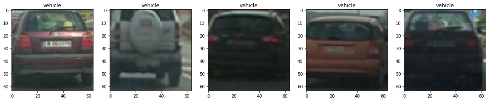
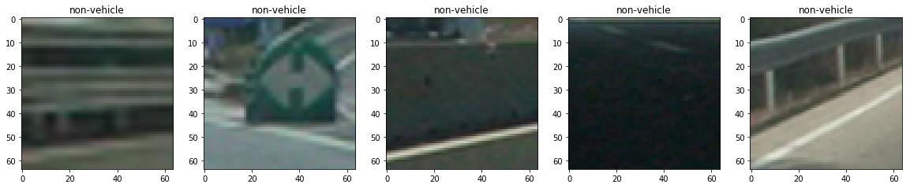
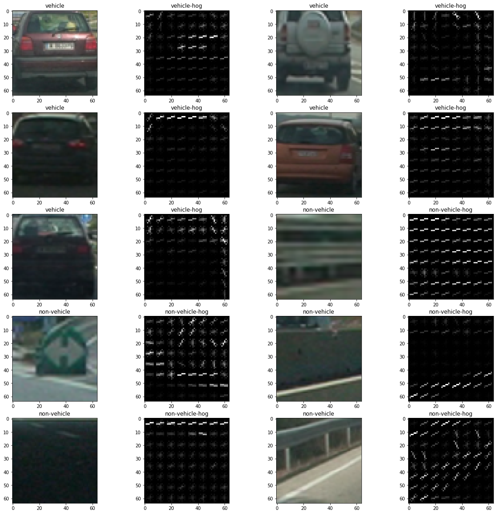
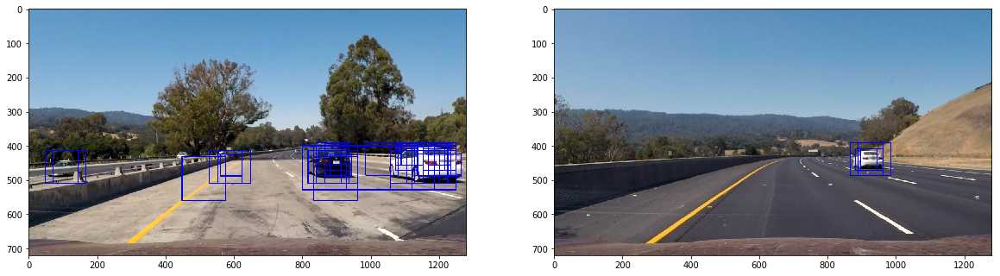
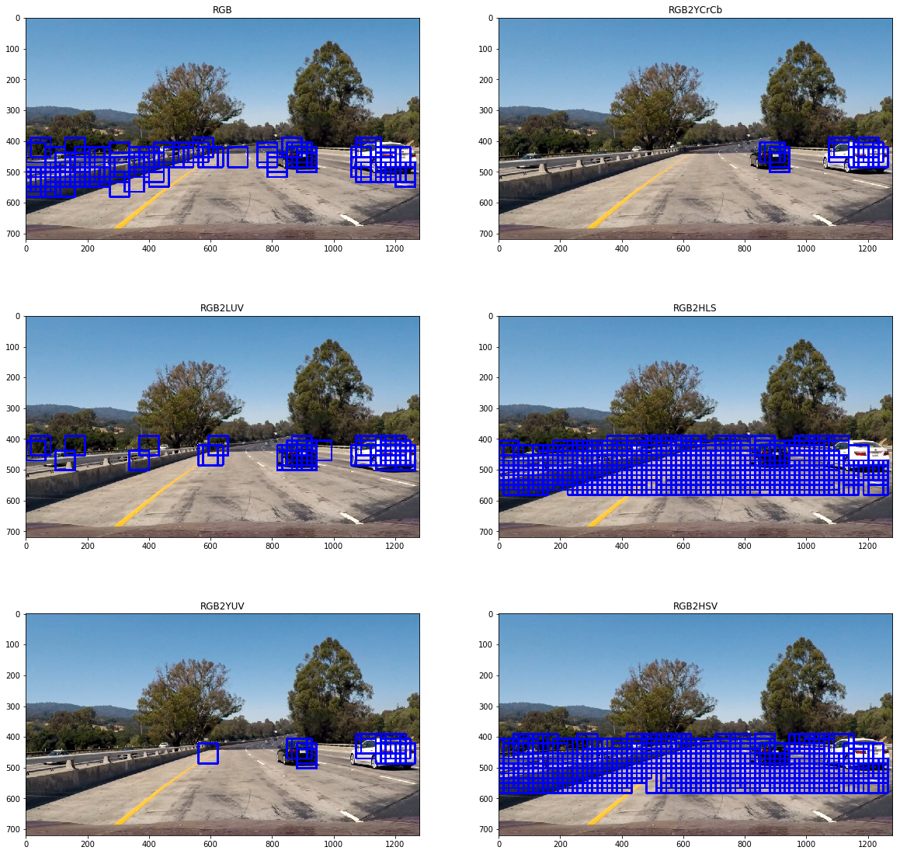
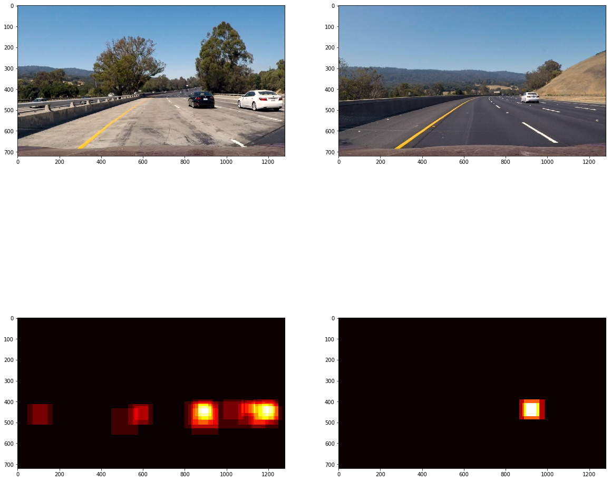
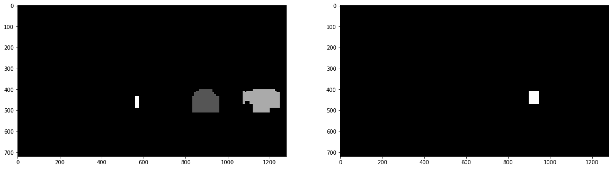
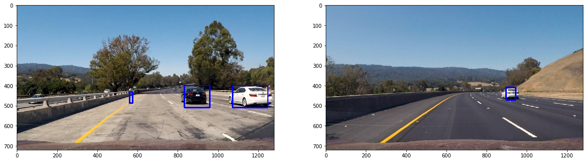

## Vehicle Detection Project

The goals / steps of this project are the following:

* Perform a Histogram of Oriented Gradients (HOG) feature extraction on a labeled training set of images and train a classifier Linear SVM classifier
* Optionally, you can also apply a color transform and append binned color features, as well as histograms of color, to your HOG feature vector. 
* Note: for those first two steps don't forget to normalize your features and randomize a selection for training and testing.
* Implement a sliding-window technique and use your trained classifier to search for vehicles in images.
* Run your pipeline on a video stream (start with the test_video.mp4 and later implement on full project_video.mp4) and create a heat map of recurring detections frame by frame to reject outliers and follow detected vehicles.
* Estimate a bounding box for vehicles detected.

### Histogram of Oriented Gradients (HOG)

#### 1. Explain how (and identify where in your code) you extracted HOG features from the training images.

The code for this step is contained in the 5th and 6th code cell of the IPython notebook.

I started by reading in all the `vehicle` and `non-vehicle` images.
Here is an example of one of each of the `vehicle` and `non-vehicle` classes:




I then explored different color spaces and different `skimage.hog()` parameters
(`orientations`, `pixels_per_cell`, and `cells_per_block`). I grabbed the first
5 images from each of the two classes and displayed them to get a feel for what
the `skimage.hog()` output looks like.

Here is an example using the `YCrCb` color space and HOG parameters of
`orientations=8`, `pixels_per_cell=(8, 8)` and `cells_per_block=(2, 2)`:




#### 2. Explain how you settled on your final choice of HOG parameters.

I used the parameters from the lecture. I tried with different combination of
`orientations`, `pixels_per_cell`, and `cells_eper_block` but got errors saying
shapes were wrong.

#### 3. Describe how (and identify where in your code) you trained a classifier using your selected HOG features (and color features if you used them).

I trained a linear SVM using scilearn's `LinearSVC` model. I splited the
features and labels data into traning data and test data.

```python

rand_state = np.random.randint(0, 100)
X_train, X_test, y_train, y_test = train_test_split(X, y, test_size=0.2,
                                                    random_state=rand_state)

rand_state = np.random.randint(0, 100)
X_train, X_test, y_train, y_test = train_test_split(X, y, test_size=0.2,
                                                    random_state=rand_state)

print('Classifier accuracy {}'.format(svc_cls.score(X_test, y_test)))

# Classifier accuracy 0.9847972972972973
```

### Sliding Window Search

#### 1. Describe how (and identify where in your code) you implemented a sliding window search.  How did you decide what scales to search and how much to overlap windows?

I used the `slide_window` from the lecture. I eyeballed the region of interest
(y-axis) and spent a lot of time trying different combinations of windows. The
final numbers I used are:

```python

windows = [
    # ystart, ystop, scale
    [360, 600, 1],
    [390, 600, 1.5],
    [400, 600, 2],
    [550, 650, 1],
]

```



#### 2. Show some examples of test images to demonstrate how your pipeline is working.  What did you do to optimize the performance of your classifier?

I tried all the color spaces on the same test image and the best color space for
it is `YCrCb`. I also use `ALL` as hog channel to get more features. I also
normalize the features data by using `sklearn.preprocessing.StandardScaler()`.


---

### Video Implementation

#### 1. Provide a link to your final video output.  Your pipeline should perform reasonably well on the entire project video (somewhat wobbly or unstable bounding boxes are ok as long as you are identifying the vehicles most of the time with minimal false positives.)

Here's a [link to my video result](./project_video_out.mp4)


#### 2. Describe how (and identify where in your code) you implemented some kind of filter for false positives and some method for combining overlapping bounding boxes.

I recorded the positions of positive detections in each frame of the video. From
the positive detections I created a heatmap and then thresholded that map to
identify vehicle positions. I then used `scipy.ndimage.measurements.label()` to
identify individual blobs in the heatmap. I then assumed each blob corresponded
to a vehicle. I constructed bounding boxes to cover the area of each blob
detected.

### Here are 2 differnt images and their corresponding heatmaps:



### Here is the output of `scipy.ndimage.measurements.label()` on the integrated heatmap from all six frames:


### Here the resulting bounding boxes are drawn onto the last frame in the series:



### Discussion

#### 1. Briefly discuss any problems / issues you faced in your implementation of this project.  Where will your pipeline likely fail?  What could you do to make it more robust?

I spent a lot of time figuring out the search window and scale. Not sure if
there is a better way than manually tuning and eyeballing. My final video output
still contains some false positives. If I increase the heatmap threshold then
false positive will be reduced but some cars cannot be detected.

